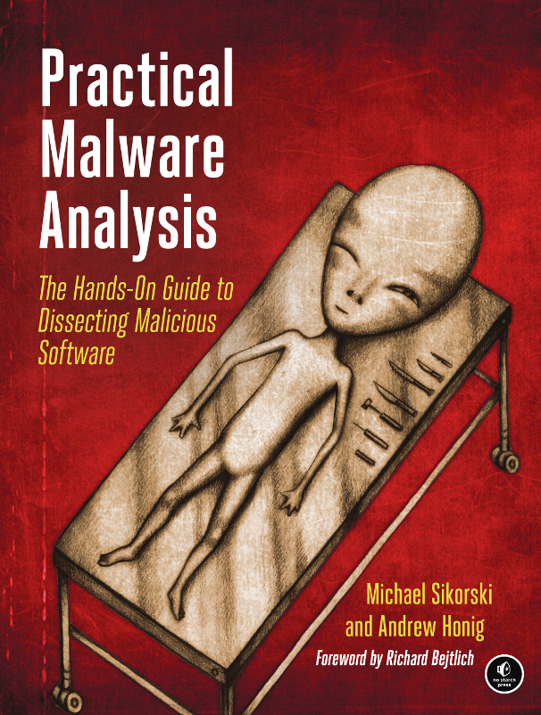

# Practical Malware Analysis

##### Authors: Michael Sikorski and Andrew Honig
##### Publisher: [No Starch Press](https://www.nostarch.com/malware)
##### Publish Date: February 2012, 800 pp.
##### ISBN: 978-1-59327-290-6
##### Purchase: [Amazon](https://www.amazon.com/dp/1593272901/)

## Progress

- **Part 1: Basic Analysis**
  - [X] [Chapter 01: Basic Static Techniques](Chapters/Chapter 01/README.md)
  - [X] [Chapter 02: Malware Analysis in Virtual Machines](Chapters/Chapter 02/README.md)
  - [X] [Chapter 03: Basic Dynamic Analysis](Chapters/Chapter 03/README.md)
- **Part 2: Advanced Static Analysis**
  - [ ] [Chapter 04: A Crash Course in x86 Disassembly](Chapters/Chapter 04/README.md)
  - [ ] [Chapter 05: IDA Pro](Chapters/Chapter 05/README.md)
  - [ ] [Chapter 06: Recognizing C Code Constructs in Assembly](Chapters/Chapter 06/README.md)
  - [ ] [Chapter 07: Analyzing Malicious Windows Programs](Chapters/Chapter 07/README.md)
- **Part 3: Advanced Dynamic Analysis**
  - [ ] [Chapter 08: Debugging](Chapters/Chapter 08/README.md)
  - [ ] [Chapter 09: OllyDbg](Chapters/Chapter 09/README.md)
  - [ ] [Chapter 10: Kernel Debugging with WinDbg](Chapters/Chapter 10/README.md)
- **Part 4: Malware Functionality**
  - [ ] [Chapter 11: Malware Behavior](Chapters/Chapter 11/README.md)
  - [ ] [Chapter 12: Covert Malware Launching](Chapters/Chapter 12/README.md)
  - [ ] [Chapter 13: Data Encoding](Chapters/Chapter 13/README.md)
  - [ ] [Chapter 14: Malware-Focused Network Signatures](Chapters/Chapter 14/README.md)
- **Part 5: Anti-Reverse-Engineering**
  - [ ] [Chapter 15: Anti-Disassembly](Chapters/Chapter 15/README.md)
  - [ ] [Chapter 16: Anti-Debugging](Chapters/Chapter 16/README.md)
  - [ ] [Chapter 17: Anti-Virtual Machine Techniques](Chapters/Chapter 17/README.md)
  - [ ] [Chapter 18: Packers and Unpacking](Chapters/Chapter 18/README.md)
- **Part 6: Special Topics**
  - [ ] [Chapter 19: Shellcode Analysis](Chapters/Chapter 19/README.md)
  - [ ] [Chapter 20: C++ Analysis](Chapters/Chapter 20/README.md)
  - [ ] [Chapter 21: 64-Bit Malware](Chapters/Chapter 21/README.md)

## Resources
  - [Running the Gauntlet: Author's website](http://practicalmalwareanalysis.com/)
